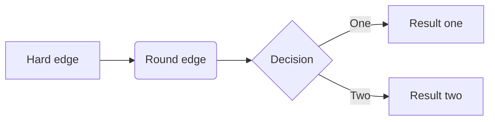

# KuckyCopter
Fun **Project** dfsdjhfkhdfhsdhh sdsdfasdfs

|tab|col1|
|---|----|
|a  | 1  |

| vbxb |  cvbc |   | cvbcv | cvb |   |
|------|:-----:|---|-------|-----|---|
| 1    | **a** |   |       |     |   |
| 2    | **b** |   |       |     |   |
| 3    | **c** |   |       |     |   |


```cpp
#include "std.io"
void main(){

}
```

