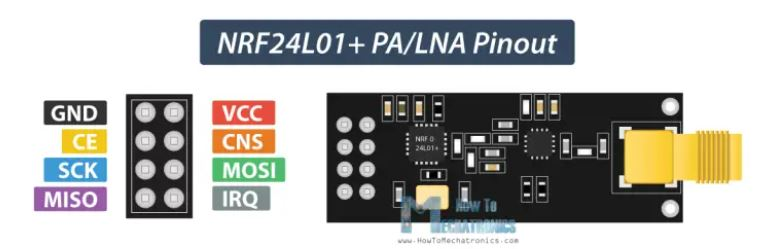

# Hardware
## Controller
Raspberry Pi Pico Entwicklung Bord TYPE-C High-Leistung Mikrocontroller-board RP2040 128Mbit 4M 16MB Dual-core ARM Prozessor

## Pins
  
## Circut Board

## IMU
Breakout CJMCU-10DOF

## Radio
NRF24

| Funkt. | Pin | GPIO  | Color | Stripe |
|------  |:-----:|---|-------|-----|---|
| MISO   | 21  | 16  |       |     |  1 |
| CSN    | 22  | 17  |       |     |  2 |
| SLK    | 24  | 18  |       |     |  3 |
| MOSI   | 25  | 19  |       |     |  4 |
| CE     | 26  | 20  |       |     |  5 |
| 3V3    |     |     |  Red  |     |   |
| GND    |     |     | Black |     |   |

## Sonic
HC-SR04

## Temperatur
DS18B20
