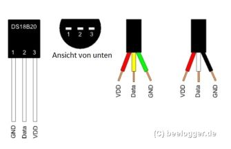

# Hardware
## Controller
Raspberry Pi Pico Entwicklung Bord TYPE-C High-Leistung Mikrocontroller-board RP2040   128Mbit 4M 16MB Dual-core ARM Prozessor

## PinOut
  

## Circut Board

1.  Vin
2. Sonic front
3. NRF24L01
4. Sonic down
5. ESC´s
6. Thermosensor
7. State LED´s
8. Position LED´s

## IMU
MPU9250/MS5611 CJMCU-117 High Precision 9 Axis 10DOF Attitude Module SPI/IIC Communication

 
**Attention: Pad NCS and PS must be connected**

Chip: MPU-9250  
Power supply: 3-5v (internal low dropout regulator)  
Communication: standard IIC / SPI communications protocol  
Chip built 16bit AD converter, 16-bit data output  
Gyroscopes range: ± 250 500 1000 2000 °/s  
Acceleration range: ± 2 ± 4 ± 8 ± 16g  
Magnetic field range: ± 4800uT  

Module Model: GY-63-03  
Name: MS5611 module (atmospheric pressure module)  
Built-in 24bit AD converter chip  
High quality Immersion Gold PCB, machine welding process to ensure quality  
Use chip: MS5611-01BA03

|Funkt.|Pin |GPIO|
|------|----|----|
|  SDA | 6  | 4  |
|  SCL | 7  | 5  |

## Radio
**NRF24**

|Funkt.|Pin |GPIO|Color|Stripe|
|------|----|----|-----|------|
| MISO | 21 | 16 |     |   1  | 
| CSN  | 22 | 17 |     |   2  |
| SLK  | 24 | 18 |     |   3  |
| MOSI | 25 | 19 |     |   4  |
| CE   | 26 | 20 |     |   5  |
| 3V3  |    |    | Red |      |
| GND  |    |    |Black|      |

Modell: E01-ML01DP5 
Schnitts telle: spi 
Leistung: 20dbm 
Abstand: 2100m
HF-Verbindungs stück: SMA-K
Frequenz: 2,4 GHz(2400MHz-2525MHz)
Feature: E01-ML01DP5 basiert auf original importierten nrf24l01p Form nordic in Norwegen. Und ausgestattet mit 20dbm Leistungsverstärker chip, der aus den USA importiert wird, wodurch die Sendeleistung 100mw (20dbm) erreicht, während die Empfangsempfindlichkeit um 10db erhöht wird. Diese Eigenschaften machen die Übertragungsdistanz 10 mal länger als nrf24l01p selbst. Die Anti-Interferenz-Abschirmung Abdeckung auf dem Modul macht die Anti-Interferenz-Leistung besser.

## Sonic
**HC-SR04 Ultrasonic Wave Detector, Distance Sensor**

1: Voltage: DC5V  
2: Quiescent Current: <2mA  
3: level output: the output of the high-5V  
4: level: the end of 0V  
5: Induction Angle: not more than 15 degrees  
6: detection range: 2cm-450cm  
7: High precision: up to 0.3cm

Panel wiring, VCC, trig 's (control side), the echo (receiving end), out (empty feet), GND
Note: TRIP-pin internal pull-up 10K resistor, down TRIP microcontroller IO port pin, and then to a 10us pulse signal.
OUT pin for this module as the switch output pin when the anti-theft module, ranging modules do not use this foot!
Note: The module should be inserted Fortunately, the circuit board re-energized, and avoid the high malfunction, if they have re-energized before they solve.
This module can be provided ranging program: C51, PIC18F877 microcontroller Yoshitatsu three MCU test reference.

**3 the module URF04 works:**  
1. IO trigger ranging to at least 10us high signal;
2. module automatically sends eight 40kHz square wave, automatically detect whether a signal return;
3. a signal to return to a high IO output, high duration of the ultrasonic time from launch to return.
Test distance = (time high * speed of sound (340M / S)) / 2;

|Funkt. |Pin |GPIO|Color|
|-------|----|----|-----|
|Echo 1 | 25 | 21 |
|Trig 1 | 29 | 22 |
|Echo 2 | 5  | 3  |
|Trig 2 | 4  | 2  |

## ESC
**BLHeli Serie 30A electronic speed controller**

|-Funkt.-|Pin |GPIO|Color|  ESC - Motor  |
|--------|----|----|-----|---------------|
| ESC FL | 15 | 11 |  x  | 1-1 ; 2-2 ; 3-3 |
| ESC FR | 16 | 12 |  x  | 1-3 ; 2-2 ; 3-1 |
| ESC BR | 17 | 13 |  x  | 1-1 ; 2-2 ; 3-3 |
| ESC BL | 19 | 14 |  x  | 1-3 ; 2-2 ; 3-1 |

brown = GND 
red = +5V 
yellow = signal 

Kontinuierlicher Strom: 30a 
Berst strom: 30a 
Lixx Batterie: 2 ~ 4s 
Abmessungen: 52*26*7mm 
Bec Ausgang: 2a/5v 
Gewicht: 28g 

Basierend auf blheli Firmware, weiter optimiert für perfekte Antriebsleistung. 
Niederspannungsschutz, Überhitzungsschutz und Drosselklappen Signal verlustsschutz. 
Separate Stromversorgung für mcu und bec, Verbesserung der esc Fähigkeit, magnetische Störungen. 
Die Esc-Parameter können über die Programmkarte oder den Sender konfiguriert werden. 
Drosselbereich kann so konfiguriert werden, dass er mit verschiedenen Empfängern kompatibel ist. 
Ausgestattet mit integriertem linearen bec oder bec Schalter. 

## Temperatur
**DS18B20 temperatur sensor**

|Funkt. |Pin |GPIO|Color|
|-------|----|----|-----|
|Temp.  | 9  | 6  |

## Alarm
**aktiver Summer kontinuierlicher Piepton 12*9,5mm 5V**

|Funkt. |Pin |GPIO|
|-------|----|----|
| Alarm | 14 | 10 |