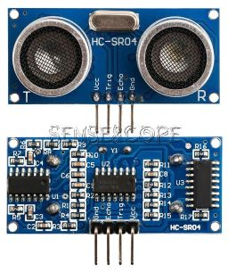

# Hardware
## Controller
Raspberry Pi Pico Entwicklung Bord TYPE-C High-Leistung Mikrocontroller-board RP2040   128Mbit 4M 16MB Dual-core ARM Prozessor

## PinOut
  

## Circut Board

1.  Vin
2. Sonic front
3. NRF24L01
4. Sonic down
5. ESC´s
6. Thermosensor
7. State LED´s
8. Position LED´s

## IMU CJMCU-117
MPU9250/MS5611 CJMCU-117 High Precision 9 Axis 10DOF Attitude Module SPI/IIC Communication

 
**Attention: Pad NCS and PS must be connected**

Chip: MPU-9250  
Power supply: 3-5v (internal low dropout regulator)  
Communication: standard IIC / SPI communications protocol  
Chip built 16bit AD converter, 16-bit data output  
Gyroscopes range: ± 250 500 1000 2000 °/s  
Acceleration range: ± 2 ± 4 ± 8 ± 16g  
Magnetic field range: ± 4800uT  

Module Model: GY-63-03  
Name: MS5611 module (atmospheric pressure module)  
Built-in 24bit AD converter chip  
High quality Immersion Gold PCB, machine welding process to ensure quality  
Use chip: MS5611-01BA03

|Funkt.|Pin |GPIO|
|------|----|----|
|  SDA | 6  | 4  |
|  SCL | 7  | 5  |

## Radio
**NRF24**

|Funkt.|Pin |GPIO|Color|Stripe|
|------|----|----|-----|------|
| MISO | 21 | 16 |     |   1  | 
| CSN  | 22 | 17 |     |   2  |
| SLK  | 24 | 18 |     |   3  |
| MOSI | 25 | 19 |     |   4  |
| CE   | 26 | 20 |     |   5  |
| 3V3  |    |    | Red |      |
| GND  |    |    |Black|      |

Model: E01-ML01DP5 
Interface: spi 
Performance: 20dbm 
Distance: 2100m
HF-Verbindungs stück: SMA-K
Frequenz: 2,4 GHz(2400MHz-2525MHz)
Feature: E01-ML01DP5 is based on original imported nrf24l01p form nordic in Norway. And equipped with 20dbm power amplifier chip imported from USA, which makes the transmitting power reach 100mw (20dbm) while increasing the receiving sensitivity by 10db. These features make the transmission distance 10 times longer than nrf24l01p itself. The anti-interference shielding cover on the module makes the anti-interference performance better.

## Sonic
**HC-SR04 Ultrasonic Wave Detector, Distance Sensor**

    1: Voltage: DC5V  
    2: Quiescent Current: <2mA  
    3: level output: the output of the high-5V  
    4: level: the end of 0V  
    5: Induction Angle: not more than 15 degrees  
    6: detection range: 2cm-450cm  
    7: High precision: up to 0.3cm

    Panel wiring, VCC, trig 's (control side), the echo (receiving end), out (empty feet), GND
    Note: TRIP-pin internal pull-up 10K resistor, down TRIP microcontroller IO port pin, and then to a 10us pulse signal.
    OUT pin for this module as the switch output pin when the anti-theft module, ranging modules do not use this foot!
    Note: The module should be inserted Fortunately, the circuit board re-energized, and avoid the high malfunction, if they have re-energized before they solve.
    This module can be provided ranging program: C51, PIC18F877 microcontroller Yoshitatsu three MCU test reference.
    IO trigger ranging to at least 10us high signal;
    module automatically sends eight 40kHz square wave, automatically detect whether a signal return;
    a signal to return to a high IO output, high duration of the ultrasonic time from launch to return.
    Test distance = (time high * speed of sound (340M / S)) / 2;

|Funkt. |Pin |GPIO|Color|
|-------|----|----|-----|
|Echo 1 | 25 | 21 |
|Trig 1 | 29 | 22 |
|Echo 2 | 5  | 3  |
|Trig 2 | 4  | 2  |

## ESC
**BLHeli Serie 30A electronic speed controller**

|-Funkt.-|Pin |GPIO|Color|  ESC - Motor  |
|--------|----|----|-----|---------------|
| ESC FL | 15 | 11 |  x  | 1-1 ; 2-2 ; 3-3 |
| ESC FR | 16 | 12 |  x  | 1-3 ; 2-2 ; 3-1 |
| ESC BR | 17 | 13 |  x  | 1-1 ; 2-2 ; 3-3 |
| ESC BL | 19 | 14 |  x  | 1-3 ; 2-2 ; 3-1 |

brown = GND 
red = +5V 
yellow = signal 

Continuous stream: 30a 
Berststrom: 30a 
Lixx Batterie: 2 ~ 4s 
Dimensions: 52*26*7mm 
Bec output: 2a/5v 
Weight: 28g 

Based on blheli firmware, further optimized for perfect drive performance. 
Low voltage protection, overheating protection and throttle signal loss protection. 
Separate power supply for mcu and bec, improve esc ability, magnetic interference. 
The Esc parameters can be configured via the program card or the transmitter. 
Throttle range can be configured to be compatible with different receivers. 
Equipped with integrated linear bec or bec switch. 

## Temperature
**DS18B20 temperature sensor**

    Supply Voltage: 3.0V to 5.5V DC.
    Current consumption: 4mA max.
    Measuring temperature range: -55°C to +125°C.
    Accuracy: ±0.5°C (from -10°C to +85°C)

|Funkt. |Pin |GPIO|Color|
|-------|----|----|-----|
|Temp.  | 9  | 6  |

The core functionality of the DS18B20 is its direct-to- digital temperature sensor. The resolution of the tempera- ture sensor is user-configurable to 9, 10, 11, or 12 bits, corresponding to increments of 0.5°C, 0.25°C, 0.125°C, and 0.0625°C, respectively. The default resolution at power-up is 12-bit.

## Battery alert
**active buzzer continuous beep 12*9,5mm 5V**
NEUE HC-05 HC 05 hc-06 HC 06 RF Wireless Bluetooth Transceiver Slave Modul RS232 / TTL zu UART converter und adapter

|Funkt. |Pin |GPIO|
|-------|----|----|
| Alarm | 14 | 10 |

## BT Modul
**HC 06 RF Wireless Bluetooth Transceiver Slave Modul RS232 / TTL zu UART converter und adapter**

1. Works with any USB Bluetooth adapter.
2. Default baud rate: 9600,8,1,n.
3. Built-in antenna.
4. Bluetooth version: v2.0 + edr
5. Operating voltage: 3.3~6V
6. Signal coverage: 30ft
7. Cable length: 21.5cm
8. Item size: 4.3*1.6*0.7cm
9. Piece weight: 3g
10. With LED indicator lamp, use 150ma and 3.3v rule chip.
11. With "re-seach" button (on/off/wake foot for it, external mcu outinput "high level" can control module to seach again)
12. Compatible with Bluetooth master module "slave module" or master-slave (whole) module.
13. Size: 1.55cm*3.98cm
