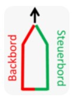

# Recources

## Propeller rotation order

## CW red screw nut 
## CCW black screw nut 

## Position LEDs

## Battery state 

[LiPo Beschreibung](https://fpvracing.ch/de/content/21-lipo-batterien)

|Battery voltage |analog|
|------|------|
|12,2V | 933|
|11,3V | 872|
|10,1V | 777|
| 9,5V | 730|
| 8,1V | 626|

